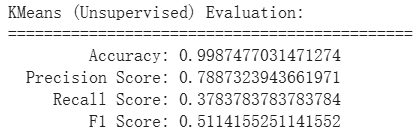

# 監督式學習 - 調整random forest參數 
>* **最佳實驗結果**
```python
    X = np.asarray(data.iloc[:, ~data.columns.isin(['Class'])])
    Y = np.asarray(data.iloc[:, data.columns == 'Class'])

    # # split training set and data set
    X_train, X_test, Y_train, Y_test = train_test_split(X, Y, test_size=TEST_SIZE, random_state=RANDOM_SEED)

    Y_train = Y_train.ravel()
    Y_test = Y_test.ravel()

    # # build Random Forest model
    rf_model = RandomForestClassifier(
        n_estimators=100,
        random_state=RANDOM_SEED,
        class_weight={0: 1, 1: 5.5},
        max_features=10
    )

    rf_model.fit(X_train, Y_train)

```

> 相較於範例
Accuracy：增加約0.00001
Precision：增加約0.0005
Recall：增加約0.01
F1：增加約0.01
* 說明：
我嘗試調整以下這些參數，以提升模型效果：
    * `max_depth`：每顆決策樹最長深度(預設為none)，深度較深模型較複雜，效果較好，但太深可能會overfitting
    * `max_features`：決策樹每次分裂時考慮的特徵數量，預設值為sqrt(feature總數)
    * `class_weight`：給予不同類別不同權重，在極度不平衡的資料集中，利用權重設定能夠讓模型對於數量較少的詐欺類別較敏感

* **實驗過程**：
    *  實驗1：weight先隨機挑選，feature數量則調為預設(sqrt(28) = 5)的兩倍
        ```python
        rf_model = RandomForestClassifier(
            n_estimators=100,
            random_state=RANDOM_SEED,
            class_weight={0: 1, 1: 4.5},
            max_features=10
        )
        ```
        
    *   實驗2：嘗試將詐欺類別的weight提高訓練模型更加準確
        ```python
        rf_model = RandomForestClassifier(
            n_estimators=100,
            random_state=RANDOM_SEED,
            class_weight={0: 1, 1: 5.5},
            max_features=10
        )
        ```
        
    *   實驗3：嘗試再提高權重，但precision、recall反而下降，詐欺交易的權重太重導致模型過於傾向判斷為類別1
        ```python
        rf_model = RandomForestClassifier(
            n_estimators=100,
            random_state=RANDOM_SEED,
            class_weight={0: 1, 1: 6},
            max_features=10
        )
        ```
        
    *   實驗4：提高樹的深度(預設是max_depth=7)讓模型變得更複雜，recall雖然上升，但precision反而下降
        ```python
        rf_model = RandomForestClassifier(
            n_estimators=100,
            random_state=RANDOM_SEED,
            class_weight={0: 1, 1: 5.5},
            max_features=10,
            max_depth=9
        )
        ```
        
    *   實驗5：提高feature讓模型變得更複雜，但學得太仔細造成recall下降
        ```python
        rf_model = RandomForestClassifier(
            n_estimators=100,
            random_state=RANDOM_SEED,
            class_weight={0: 1, 1: 5.5},
            max_features=12
        )
        ```
        


* random forest簡介：
training過程中對同一個資料集抽樣出K組子資料集(可能一筆或多筆數據)，形成K個決策樹(弱學習器)，每棵樹會依據label學習如何分類(根據真實標籤進行分裂)。
testing過程中將測試資料放入剛剛訓練出的K個tree中判斷，每顆樹有自己的預測結果，以多數決投票決定預測結果(eg：100 棵樹裡有 80 棵說這筆交易是異常 → 預測結果 = 異常（1）)
p.s. 由於只有一個資料集，因此對同一個資料集進行有放回的取樣以形成多棵樹

* 參考資料：
[randomForest說明](https://medium.com/chung-yi/ml%E5%85%A5%E9%96%80-%E5%8D%81%E4%B8%83-%E9%9A%A8%E6%A9%9F%E6%A3%AE%E6%9E%97-random-forest-6afc24871857)
[randomForest參數1](https://ithelp.ithome.com.tw/articles/10359301)
[randomForest參數2](https://www.alibabacloud.com/help/tc/polardb/polardb-for-mysql/user-guide/random-forest-regression-algorithm)


# 非監督式學習 - PCA+kMeans
>* **最佳實驗結果**
先利用PCA找出主要的15個特徵再進行kMeans分類
```python
    # PCA 降維
    pca = PCA(n_components=15)  
    x_train = pca.fit_transform(x_train)
    x_test = pca.transform(x_test)

    kmeans = KMeans(
       n_clusters=k,
       init='k-means++',
       random_state=RANDOM_SEED,
       max_iter=500, 
       n_init=20
       )
```

> 相較於範例
Accuracy：增加約0.00002
Precision：增加約0.006
Recall：增加約0.01
F1：增加約0.02

* 說明：
調整PCA中參數
    *   `n_components`：要保留的主要特徵個數或是要保留的資料變異比例(模型會自動找到要保留的特徵數)，若是縮減到太小資訊量會太少損失太多有用的資訊，可能會無法分類，若保留太多特徵則模型可能學習到雜訊
在kMeans中手動設定兩個參數(固定)
    *   `max_iter`：最多進行幾次中心點的更新，若太少可能會還沒收斂就停止了
    *   `n_init`：分成k群時要進行幾次分群嘗試(選出幾組初始中心點)，最後會選出最好的一次

* **實驗過程**：
    *  實驗1：提高特徵數後結果略為變好
    ```python
       pca = PCA(n_components=15) 
    ```
    
    *  實驗2：但再增加特徵數結果沒有明顯變化，可能是15個特徵已經涵蓋了大部分特徵值，其他特徵可能是不重要的資訊
    ```python
    pca = PCA(n_components=20)
    ```
    
     *  實驗3：降低特徵數到7時不論precision還是recall都降低，可能有重要的特徵被忽略了
    ```python
    pca = PCA(n_components=7)
    ```
    

* 參考資料：
[非監督模型選擇](https://ithelp.ithome.com.tw/m/articles/10330254)
[isolation forest簡介](https://medium.com/@AppliedDataScienceWeeklyNew/%E8%B3%87%E6%96%99%E7%A7%91%E5%AD%B8%E6%87%89%E7%94%A8%E5%88%86%E4%BA%AB-%E7%95%B0%E5%B8%B8%E6%AA%A2%E6%B8%AC-isolation-forest-ae40562ac4cf)