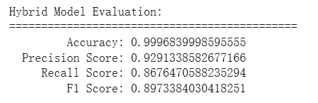

# 非監督式+監督式 - isolation forest + XGBoost
>* **最佳實驗結果**
```python
from imblearn.over_sampling import SMOTE

# Extract features and labels
X = np.asarray(data.drop(columns=['Class']))
y = np.asarray(data['Class'])

# Split the dataset into training and testing sets (with stratification)
x_train, x_test, y_train, y_test = train_test_split(
    X, y, test_size=TEST_SIZE, random_state=RANDOM_SEED
)

# PCA 降維
pca = PCA(n_components=25)  # 嘗試 2-20 的不同值
x_train = pca.fit_transform(x_train)
x_test = pca.transform(x_test)

# Step 1: 用正常交易訓練 Isolation Forest
iso = IsolationForest(
    contamination=0.0017, #因為給予的資料都是正常交易，沒有詐欺交易，所以讓模型自己找異常的比例
    random_state=RANDOM_SEED,
    n_estimators=600,
    max_features=15,
    bootstrap=True
    )
iso.fit(x_train)

# Step 2: 用全部資料做預測（正常/異常）
iso_labels = iso.predict(x_train)
iso_labels = (iso_labels == -1).astype(int)  # -1 是異常，轉成 1

x_train = np.hstack([x_train, iso_labels.reshape(-1, 1)])
iso_pred_test = iso.predict(x_test)
iso_feature_test = (iso_pred_test == -1).astype(int)
x_test = np.hstack((x_test, iso_feature_test.reshape(-1, 1)))

xg_model = XGBClassifier(
    objective='binary:logistic',
    n_estimators=550,
    scale_pos_weight=6,
    max_depth=7,
    random_state=RANDOM_SEED,
)

xg_model.fit(x_train, y_train)

# Step 5: 預測測試集
threshold = 0.3
y_proba = xg_model.predict_proba(x_test)[:, 1]  # 取得預測為正類（詐欺）的機率
y_pred = (y_proba > threshold).astype(int)
```

> 相較於範例
Accuracy：增加約0.00001
Precision：增加約0.001
Recall：增加約0.007
F1：增加約0.004
* 說明：

* **實驗過程**：
    *  實驗1：xgboost `n_estimators=200`
        
    *  實驗2：xgboost `max_depth=5`
        
    *  實驗3：isolation forest `contamination=0.0017`
        
    *  實驗4：不使用`stratify=y`
        
    *   實驗5：xgboost`scale_pos_weight=6`
        
    *   實驗6：xgboost`max_depth=7`
        
    *   實驗7：isolation`max_features=15`
        

