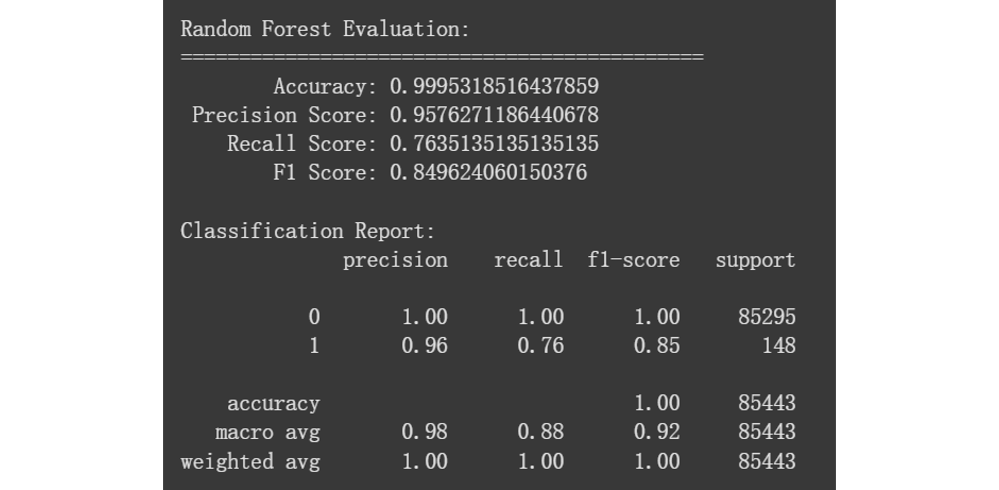
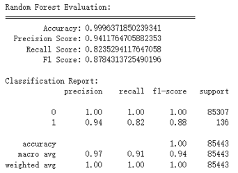
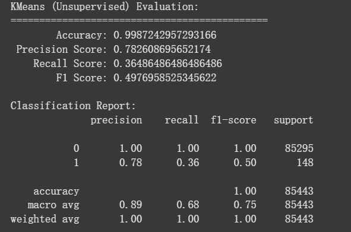
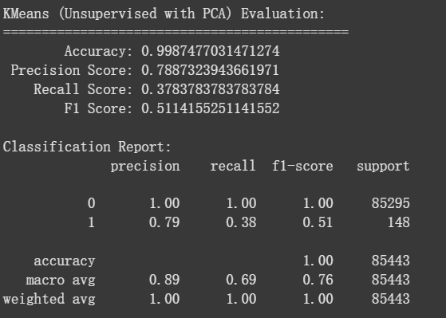

# 監督式學習（Random Forest）

##  Result
 <!-- 在這裡放你的圖片路徑 -->

##  範例 Result
 <!-- 範例圖片路徑 -->

---

##  改動內容

### 一、標籤格式與資料準備簡化

原始程式使用 `np.asarray()` 會呈現二維陣列，但我在執行時系統會報錯。  
因此我改用一維格式。原先我在後面加上 `.ravel()`，但仍會出現錯誤訊息。  
最後我使用 `.values` 直接取得一維陣列格式，成功解決問題。

### 二、使用 Stratified Sampling 確保比例

在 `split_data` 的部分加入 `stratify=Y` 參數，確保 Training Set 與 Testing Set 的比例為 7:3。  
這樣能避免 fraud 樣本因隨機分配導致結果不精確。

---

# 非監督式學習

##  範例程式 Result
 <!-- 範例圖片路徑 -->

##  Result
 <!-- 結果圖片路徑 -->

---

##  改動內容

### 1. 加入了 PCA，減少資料冗餘

使用 PCA（主成分分析）將高維資料轉換成較少維度，以提升效率並減少過度擬合的風險。

[def]: ./images/ra