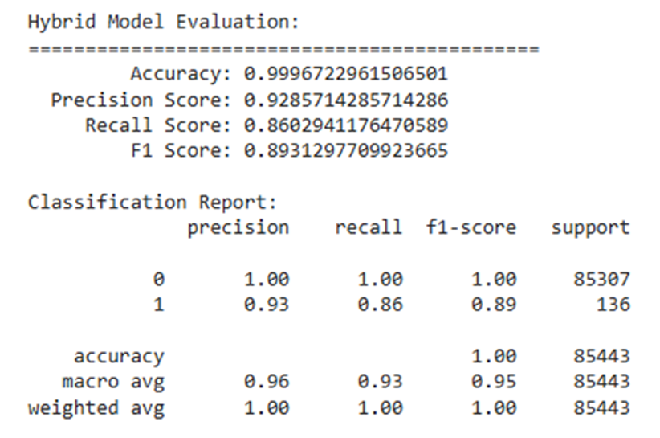
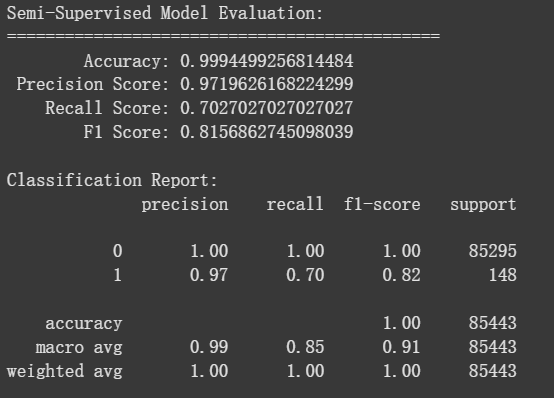

# 非監督式學習

## 範例結果
 <!-- 請自行補上圖片 -->

## 結果
 <!-- 請自行補上圖片 -->

---

##  說明

本實驗以 **Random Forest** 作為 baseline，並使用 **Pseudo-labeling** 來模擬非監督式學習。

選擇此策略的原因如下：

- 嘗試了多種監督與非監督模型的組合後，發現 **Random Forest** 作為監督式模型的結果較為穩定。
- 然而，與各種非監督式學習模型搭配後，效果未如預期。
- 最終選擇了使用 **Pseudo-labeling**（偽標記）來模擬非監督式學習的形式，而非直接引用完整非監督模型架構。

儘管在提升 **Accuracy** 和 **Precision** 的同時，其他指標（如 Recall 或 F1）略有下降，  
但目前此結果為我在多次嘗試後得到的最佳解（不含範例程式結果）。