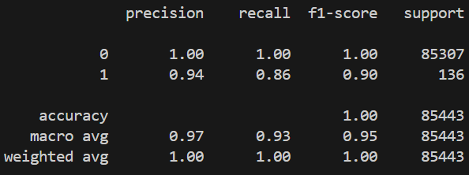

# 作業繳交 ACS111111

## 截圖



## 實作

### Random forest

實驗1 :

```=
rf_model = RandomForestClassifier(
    n_estimators=100,
    max_depth=25,
    random_state=RANDOM_SEED,
)
// threshold = 0.485
```

結果 -

```
              precision    recall  f1-score   support

           0       1.00      1.00      1.00     85307
           1       0.93      0.85      0.88       136

    accuracy                           1.00     85443
   macro avg       0.97      0.92      0.94     85443
weighted avg       1.00      1.00      1.00     85443
```

### XGBoost

#### 實驗1 :

```
xgb_model = XGBClassifier(
    n_estimators=95,
    max_depth=8,
    scale_pos_weight=len(nonfraud) * 2 / len(fraud),  # 不平衡補償
    eval_metric="logloss",
    random_state=RANDOM_SEED,
)
// threshold = 0.6
```

結果:

```
              precision    recall  f1-score   support

           0       1.00      1.00      1.00     85307
           1       0.94      0.86      0.90       136
   1.00     85443
   macro avg       0.97      0.93      0.95     85443
weighted avg       1.00      1.00      1.00     85443
```
---
#### 實驗2 :

(有加新參數，我先亂試看看)

```
xgb_model = XGBClassifier(
    n_estimators=300,
    max_depth=6,
    learning_rate=0.05,
    subsample=0.8,
    colsample_bytree=0.8,
    scale_pos_weight=len(nonfraud) * 2 / len(fraud),
    gamma=1,
    min_child_weight=5,
    eval_metric="logloss",
    random_state=RANDOM_SEED,
)
// threshold = 0.5
```

結果:

```
              precision    recall  f1-score   support

           0       1.00      1.00      1.00     85307
           1       0.80      0.88      0.84       136

    accuracy                           1.00     85443
   macro avg       0.90      0.94      0.92     85443
weighted avg       1.00      1.00      1.00     85443
```
---
#### 實驗3 :

(我設一個指標看看是over還是underfitting)

```
xgb_model = XGBClassifier(
    n_estimators=180,
    max_depth=8,
    learning_rate=0.2,
    subsample=0.8,
    scale_pos_weight=len(nonfraud) * 2 / len(fraud),
    gamma=0.5,
    min_child_weight=5,
    eval_metric="logloss",
    random_state=RANDOM_SEED,
)
// threshold = 0.65
```

結果:

```
              precision    recall  f1-score   support

           0       1.00      1.00      1.00     85307
           1       0.89      0.86      0.88       136

    accuracy                           1.00     85443
   macro avg       0.95      0.93      0.94     85443
weighted avg       1.00      1.00      1.00     85443

Train F1: 0.9971988795518207  
Test  F1: 0.8676470588235294
```
---
#### 實驗4 :

(train的F1很高但test很低，overfitting了，所以調低n_estimators，然後其他參數都試過一遍後發現還是預設值好)  
(最後我把所有想到的參數都試了一遍，結論都是Train跟Test一起下去，所以就到這邊)

```
xgb_model = XGBClassifier(
    n_estimators=50,
    max_depth=8,
    scale_pos_weight=len(nonfraud) * 2 / len(fraud),  # 不平衡補償
    eval_metric="logloss",
    random_state=RANDOM_SEED,
)
// threshold = 0.65 or 0.7
```

```
              precision    recall  f1-score   support

           0       1.00      1.00      1.00     85307
           1       0.94      0.86      0.90       136

    accuracy                           1.00     85443
   macro avg       0.97      0.93      0.95     85443
weighted avg       1.00      1.00      1.00     85443

Train F1: 0.9985974754558204
Test  F1: 0.8796992481203008
```

## 參考資料
[Random forest 介紹](https://ithelp.ithome.com.tw/articles/10272586)
(被我放棄了)

[XGBoost 介紹](https://ithelp.ithome.com.tw/articles/10273094)

[XGBoost 參數調整參考](https://www.itread01.com/articles/1476146171.html)

[Introduction to Boosted Trees](https://xgboost.readthedocs.io/en/latest/tutorials/model.html)

## 筆記區

關於XGBoost參數:
* eta(0.3) // learning rate(典型值0.01~0.2)
* min_child_weight(1) // 最小樣本權重和，值調大可避免overfitting，太大會underfitting
* max_depth(6) // 樹的最大深度，避免overfitting(典型值3~10)
* gamma(0) // 指定節點分裂所需的最小loss function下降值，值越大算法越保守
* subsample(1) //隨機采樣的比例，越小越不會overfitting(典型值0.5~1)
* scale_pos_weight(1) //處理樣本比例不平衡問題