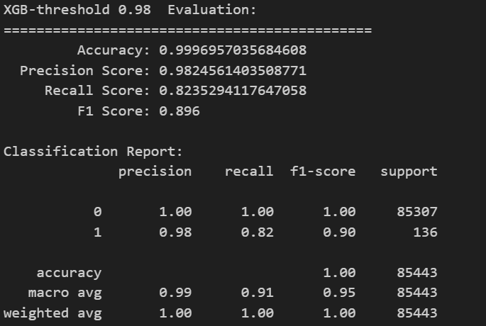

# 作業繳交 ACS111111-2

## 截圖


## 實作紀錄

因為前一份作業已經有監督(XGBoost)，跟非監督(AE)，所以這邊就直接把他們拼起來。
(AE參數不變)
XGBoost參數:
```
xgb_model = XGBClassifier(
    n_estimators=150,
    max_depth=8,
    # 處理資料集不平衡
    scale_pos_weight=len(nonfraud) / len(fraud),
    eval_metric="logloss",
    learning_rate=0.1,
    random_state=RANDOM_SEED,  # 42
)
```

```
XGB-threshold 0.980  Evaluation:
=============================================
         Accuracy: 0.9996957035684608
  Precision Score: 0.9741379310344828
     Recall Score: 0.8308823529411765
         F1 Score: 0.8968253968253969

Classification Report:
              precision    recall  f1-score   support

           0       1.00      1.00      1.00     85307
           1       0.97      0.83      0.90       136

    accuracy                           1.00     85443
   macro avg       0.99      0.92      0.95     85443
weighted avg       1.00      1.00      1.00     85443

Train F1: 1.0
Test  F1: 0.8614232209737828
```

(待續...因為我真的找不到方法讓他變0.91了)

## 筆記區

用暴力法測出最好的參數
```
from sklearn.model_selection import GridSearchCV
from xgboost import XGBClassifier

params = {
    "n_estimators": [50, 75, 100, 125, 150],
    "max_depth": [6, 7, 8, 9],
    "learning_rate": [0.05, 0.1],
    "scale_pos_weight": [len(nonfraud) / len(fraud), len(nonfraud) * 2 / len(fraud)],
}

grid = GridSearchCV(
    XGBClassifier(random_state=42), param_grid=params, scoring="f1", cv=3, n_jobs=-1
)

grid.fit(X_train_aug, y_train)

print("Best Parameters:", grid.best_params_)
```
`Best Parameters: {'learning_rate': 0.1, 'max_depth': 8, 'n_estimators': 150, 'scale_pos_weight': 1155.7520325203252}`