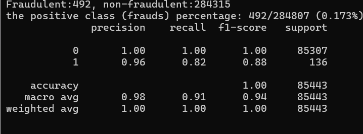
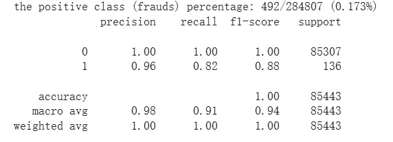

# 信用卡詐騙偵測 - 使用 Random Forest
### 實驗結果

### 簡介
利用機器學習技術，對信用卡交易進行分類，辨識出可能的詐騙交易。使用公開資料集 Credit Card Fraud Detection，並透過 RandomForestClassifier 來建立模型，進行分類任務。

該資料集極度不平衡，Fraudulent:492, non-fraudulent:284315
the positive class (frauds) percentage: 492/284807 (0.173%)

class 0/1, 0 = 非詐欺資料; 1 =詐欺資料;

### 使用環境
Anaconda (conda)
conda venv 自定義虛擬環境
python 版本 3.10.15

```bash
conda create -n venv python=3.10.15
conda activate venv
```
### 使用套件
```bash
numpy
pandas
scikit-learn
imbalanced-learn #預留給SMOTE用，因資料是極不平衡資料，但使用後無效果，備用
kagglehub
```

### Random Forest 模型與參數說明
Random Forest 的核心概念是：結合多棵使用 GINI 指標的 CART 決策樹，並透過隨機抽樣訓練資料，來提升整體模型的預測效能。顧名思義，它是一個由眾多決策樹組成的集成學習模型，透過整合多個「弱分類器」，達到更穩定、更準確的分類效果。

**Random Forest = Bagging + Decision Tree**

**Bagging**: 要建立多棵樹卻只有一個資料集時，從一組Data中生出多組Dataset，從訓練資料集中隨機抽取 K 筆樣本（採用有放回的方式），並利用這些樣本各自訓練出一棵決策樹。由於抽樣是有放回的，這些 K 筆樣本之間可能會有重複，但每棵樹所看到的資料仍略有不同，因此每棵樹之間會有差異。最終，所有樹的預測結果會以多數決（Majority Voting）的方式進行整合，做出最終的分類判斷。

簡單來說，Random Forest 就是把資料集分給很多棵決策樹，各自進行判斷，最後透過投票的方式決定最終分類結果。

**使用參數**
```bash
RandomForestClassifier(
    n_estimators=85,                 # 使用 85 棵樹進行投票
    class_weight='balanced_subsample',  # 每棵樹針對類別權重調整，幫助學習詐騙樣本
    min_samples_leaf=2,             # 每個葉節點最少 2 筆樣本（防過擬合）
    min_samples_split=3,            # 每個節點至少 3 筆樣本才能再分裂
    oob_score=True,                 # 啟用 Out-of-Bag 估計
    max_features='sqrt',            # 每棵樹每次分裂只考慮 sqrt(n) 個特徵（提升泛化）
    max_depth=25,                   # 限制樹的最大深度=25
    random_state=RANDOM_SEED        # 固定seed = 42
)
```

### 模型在測試集上的分類表現如下：


### 參考資料
- [ML入門(十七)：隨機森林 Random Forest](https://medium.com/chung-yi/ml%E5%85%A5%E9%96%80-%E5%8D%81%E4%B8%83-%E9%9A%A8%E6%A9%9F%E6%A3%AE%E6%9E%97-random-forest-6afc24871857)，作者：鍾毅，發布於 Medium
- CSDN 用戶 weixin_45281949（2019）。[隨機森林 Random Forest 詳解](https://blog.csdn.net/weixin_45281949/article/details/102767177)，CSDN 部落格。
- CSDN 用戶 qq_16633405（2017）。[機器學習算法之隨機森林（Random Forest）原理詳解](https://blog.csdn.net/qq_16633405/article/details/61200502)，CSDN。

### 資料集
- ULB Machine Learning Group（2016）。[Credit Card Fraud Detection Dataset](https://www.kaggle.com/datasets/mlg-ulb/creditcardfraud/data)，Kaggle。