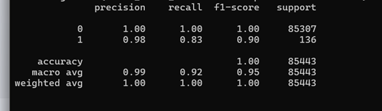
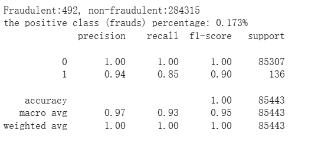

# Credit Card Fraud Detection using XGBoost Classifier
## 實驗結果

## 簡介
利用機器學習技術，對信用卡交易進行分類，辨識出可能的詐騙交易。使用公開資料集 Credit Card Fraud Detection，並透過 XGBoost Classifier 來建立模型，進行分類任務。

該資料集極度不平衡，Fraudulent:492, non-fraudulent:284315
the positive class (frauds) percentage: 492/284807 (0.173%)

class 0/1, 0 = 非詐欺資料; 1 =詐欺資料;

## 使用環境
Anaconda (conda)
conda venv 自定義虛擬環境
python 版本 3.10.15

```bash
conda create -n venv python=3.10.15
conda activate venv
```
## 使用套件
```bash
numpy
pandas
scikit-learn
xgboost
kagglehub
```

## XGBoost 模型與參數說明
XGBoost （Extreme Gradient Boosting）是一種執行效率高、預測效能優秀的採用推進式模型。它是一種從基本模型抽取創造出強模型的群組方法，特別適合解決資料不平衡與高線性問題，在每一輪中，XGBoost 會根據 前一輪的預測誤差（即 loss 的負梯度），學習一棵新的決策樹來預測這些誤差，每棵新生成的樹，會針對錯誤調整預測，嘗試糾正之前模型未能擬合的部分(具有前後依賴性)。

**XGBoost = Boosting + CART Decision Tree**

Boosting: 把多個弱模型（weak learners）串聯起來，每一個新模型用來修正前一個模型犯的錯誤，最後形成一個強模型。

CART Tree：二元分裂、適用於分類與回歸，使用 Gini impurity或 MSE等指標來進行節點分裂選擇。

**使用參數**
```bash
XGBClassifier(
    colsample_bytree=1.0,           # 每棵樹使用全部特徵
    learning_rate=0.1,            
    max_depth=7,                   # 每棵樹最大深度
    n_estimators=200,              # 樹的個數=200
    subsample=0.8,                 # 每棵樹使用的標本比例
    scale_pos_weight=2.5,          # 解決資料不平衡（0/1 比例設定）
    eval_metric='logloss',         # 評估指標
    tree_method='gpu_hist',        # 使用 GPU 加速
    predictor='gpu_predictor',     # 預測也使用 GPU
    random_state=RANDOM_SEED   
)
```

## 模型在colab上的分類表現如下(無使用gpu)：


## 參考資料
- [ML入門(十七)：隨機森林 Random Forest](https://medium.com/chung-yi/ml%E5%85%A5%E9%96%80-%E5%8D%81%E4%B8%83-%E9%9A%A8%E6%A9%9F%E6%A3%AE%E6%9E%97-random-forest-6afc24871857)，作者：鍾毅，發布於 Medium
- CSDN 用戶 weixin_45281949（2019）。[隨機森林 Random Forest 詳解](https://blog.csdn.net/weixin_45281949/article/details/102767177)，CSDN 部落格。
- CSDN 用戶 qq_16633405（2017）。[機器學習算法之隨機森林（Random Forest）原理詳解](https://blog.csdn.net/qq_16633405/article/details/61200502)，CSDN。
- [Credit Card Fraud Detection using XGBoost Classifier and GridSearchCV](https://medium.com/@zargi.teddy7/credit-card-fraud-detection-using-xgboost-classifier-and-gridsearchcv-hyperparameter-tuning-631c0632e9e9)，作者：Raden Isnawan Argi Aryasatya，發布於 Medium

## 資料集
- ULB Machine Learning Group（2016）。[Credit Card Fraud Detection Dataset](https://www.kaggle.com/datasets/mlg-ulb/creditcardfraud/data)，Kaggle。