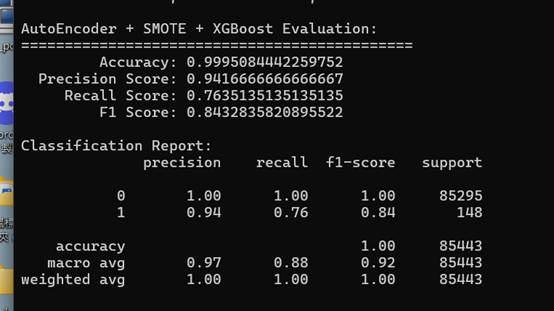

# Credit Card Fraud Detection using Autoencoder + Xgboost
## 實驗結果

## 簡介
利用機器學習技術，對信用卡交易進行分類，辨識出可能的詐騙交易。使用公開資料集 Credit Card Fraud Detection，並透過 Autoencoder + Xgboost 來建立模型，進行分類任務。

該資料集極度不平衡，Fraudulent:492, non-fraudulent:284315
the positive class (frauds) percentage: 492/284807 (0.173%)

class 0/1, 0 = 非詐欺資料; 1 =詐欺資料;

## 使用環境
Anaconda (conda)
conda venv 自定義虛擬環境
python 版本 3.10.15

```bash
conda create -n venv python=3.10.15
conda activate venv
```
## 使用套件
```bash
torch
numpy
pandas
scikit-learn
matplotlib
xgboost
imblearn
kagglehub
```

## XGBoost and Xgboost 模型與參數說明
XGBoost （Extreme Gradient Boosting）是一種執行效率高、預測效能優秀的採用推進式模型。它是一種從基本模型抽取創造出強模型的群組方法，特別適合解決資料不平衡與高線性問題，在每一輪中，XGBoost 會根據 前一輪的預測誤差（即 loss 的負梯度），學習一棵新的決策樹來預測這些誤差，每棵新生成的樹，會針對錯誤調整預測，嘗試糾正之前模型未能擬合的部分(具有前後依賴性)。

**XGBoost = Boosting + CART Decision Tree**

Boosting: 把多個弱模型（weak learners）串聯起來，每一個新模型用來修正前一個模型犯的錯誤，最後形成一個強模型。

CART Tree：二元分裂、適用於分類與回歸，使用 Gini impurity或 MSE等指標來進行節點分裂選擇。

**AutoEncoder = Encoder + Decoder**
在處理異常偵測時。可以像PCA一樣，可以從input擷取重要特徵，代表全體。當新的測試資料進來，和這樣的代表特徵比對，就可以判斷是不是異常。

在訓練過程中，模型透過最小化輸入與重建輸出之間的差異（例如 MSE 損失），逐步調整參數。若測試資料的重建誤差過大，表示該樣本可能不符合模型學到的「正常樣本」特徵，可視為異常。

**使用參數**
```bash
xgb_model = xgb.XGBClassifier(
    colsample_bytree=1.0,
    learning_rate=0.1,
    max_depth=7,
    n_estimators=200,
    subsample=0.8,
    scale_pos_weight=2.5,           
    eval_metric='logloss',
    tree_method='gpu_hist',          
    predictor='gpu_predictor',
    random_state=42
)

self.encoder = nn.Sequential(
            nn.Linear(input_dim, 32),
            nn.ReLU(),
            nn.Linear(32, 24),
            nn.ReLU(),
            nn.Linear(24, encoding_dim),
            nn.ReLU()
        )
        self.decoder = nn.Sequential(
            nn.Linear(encoding_dim, 24),
            nn.ReLU(),
            nn.Linear(24, 32),
            nn.ReLU(),
            nn.Linear(32, input_dim)
        )
```

## 參考資料
- [Credit_Card-Fraud_Detection-AutoEncoders-XGB](https://github.com/Balaviknesh/Credit_Card-Fraud_Detection-AutoEncoders-XGB/blob/master/CCFraudDetection-AutoEncoders.ipynb)，作者：Balaviknesh，發布於 github

## 資料集
- ULB Machine Learning Group（2016）。[Credit Card Fraud Detection Dataset](https://www.kaggle.com/datasets/mlg-ulb/creditcardfraud/data)，Kaggle。