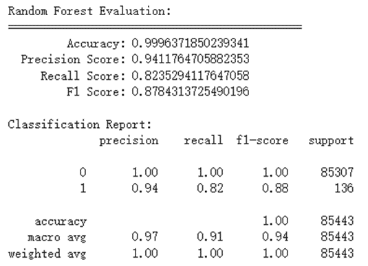

# 監督式學習 random forest
範例


改進後


主要改動是random forest的參數部分，限制了樹的最大深度並控制樹的分裂條件以及權重的部分

```python
X = np.asarray(data.iloc[:, ~data.columns.isin(['Class'])])
Y = np.asarray(data.iloc[:, data.columns == 'Class'])

# split training set and data set
X_train, X_test, y_train, y_test = train_test_split(X, Y, test_size=TEST_SIZE, random_state=RANDOM_SEED)

# build Random Forest model
rf_model = RandomForestClassifier(
    n_estimators=200,
    random_state=RANDOM_SEED,
    max_depth=15,
    min_samples_split= 5,
    min_samples_leaf= 2,
    class_weight={0: 1, 1: 9}
)

rf_model.fit(X_train, y_train)

```

# 非監督式學習 kMeans
範例


改進後


主要改動是使用了pca及更改kmeans參數，增加了max_iter=300,n_init=30的參數限制
```python
pca = PCA(n_components=15)  
x_train = pca.fit_transform(x_train)
x_test = pca.transform(x_test)

```

```python
scores = []
for k in range(2, 10):
   kmeans = KMeans(n_clusters=k, init='k-means++', random_state=RANDOM_SEED,max_iter=300,n_init=30)
   kmeans.fit(n_x_train)
   score = silhouette_score(n_x_train, kmeans.labels_)
   scores.append(score)
```
