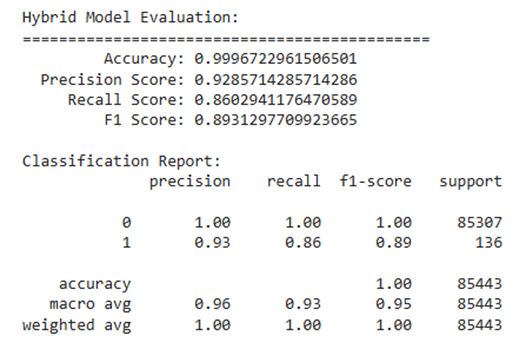
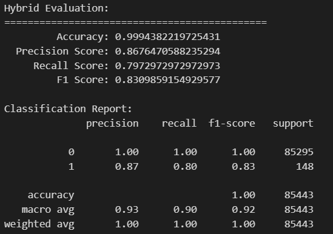

# 混合 isolation+XGBoost
範例


改進後


我試著加入pca和更換參數，但是結果還是比範例低

```python
pca = PCA(n_components=20)  
x_train = pca.fit_transform(x_train)
x_test = pca.transform(x_test)

```

```python
isolation_forest = IsolationForest(
    n_estimators=500,            
    contamination=0.0017,      
    max_samples=128,              
    max_features=0.8,            
    random_state=RANDOM_SEED     
)

```

```python
positive_class_weight = sum(y_train == 0) / sum(y_train == 1)

xgb_model = XGBClassifier(
    n_estimators=500,
    max_depth=19,
    learning_rate=0.05,
    subsample=0.7,
    colsample_bytree=0.7,
    gamma=0.1,
    scale_pos_weight=positive_class_weight,  # 設置權重
    random_state=RANDOM_SEED
)

```