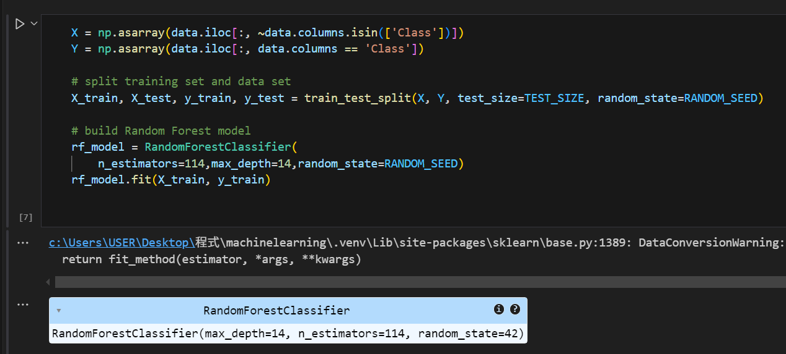
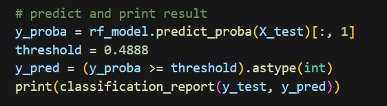
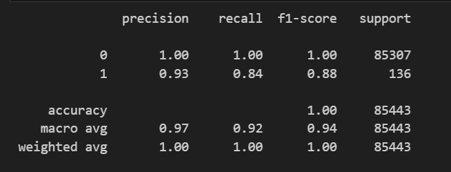
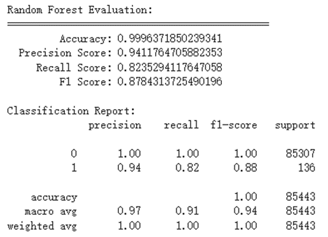
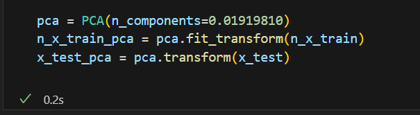
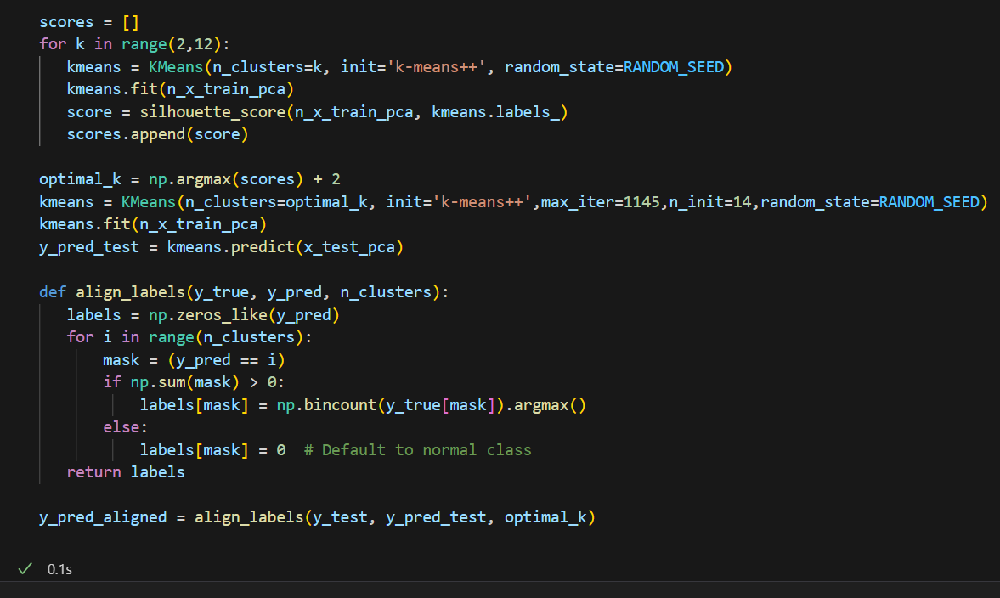
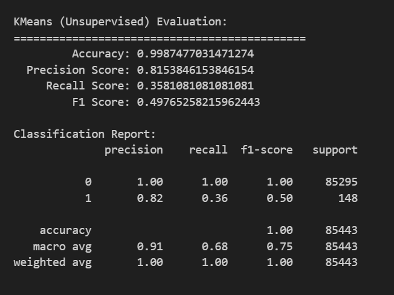
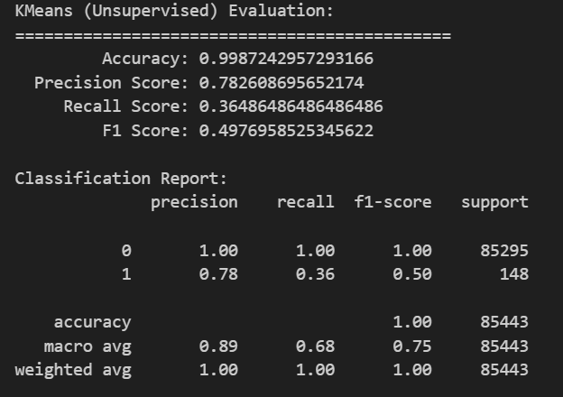

# **EX1實作紀錄:Random forest**

參數調整:

調整了初建立的樹的數量為114以提升表現，並限制單顆樹的深度為14防止overfitting

將threshold調整為0.4888 (測試出來在0.485左右會是最佳結果

結果產出:

調整後三項micro avg為 0.97 0.92 0.94

範例micro avg為 0.97 0.91 0.94

# **EX1實作紀錄:Kmeans**
參數調整:
由於只單純加上n_init定義Cluster中心點的更新次數和max_iter更新次數的上限對於模型優化沒太大幫助，於是我想到使用了PCA來將資料降維希望能優化分群效果到優化的目的

其實正常好像要保留9成到9成5的數值最好，但我試著試著只保留0.02左右的資料反而預測結果是最好的,我不太清楚為什麼qq

因加入了PCA,所以有些資料改成_pca的新變數,而參數max_iter更新次數上限設為1145而n_init更新次數設為14
結果產出:

調整後在犧牲一點點F1 score和Recall Score後提升了Accuracy和Precision Score
Accuracy 0.99872->0.99874 
Precision Score 0.7826 ->0.8153
雖然並沒有調整到全部都高於範例，但考慮到最重要的準確率和精確率都有提升便保存了下來

範例數值

參考資料
https://hackmd.io/@CynthiaChuang/Common-Evaluation-MetricAccuracy-Precision-Recall-F1-ROCAUC-and-PRAUC
https://medium.com/ai%E5%8F%8D%E6%96%97%E5%9F%8E/learning-model-random-forest-ca4e3f8a63d3
https://medium.com/@jason8410271027/%E5%AD%B8%E7%BF%92%E7%AD%86%E8%A8%98-k-means%E5%AF%A6%E4%BD%9C%E7%AF%87-5c3fb9faf17
https://ithelp.ithome.com.tw/m/articles/10299735
