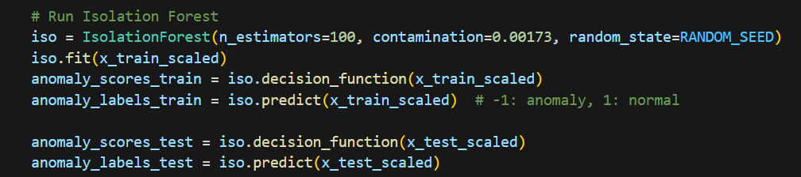
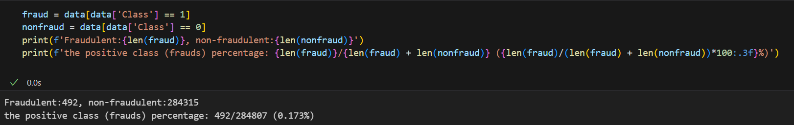
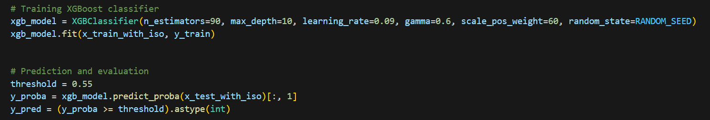
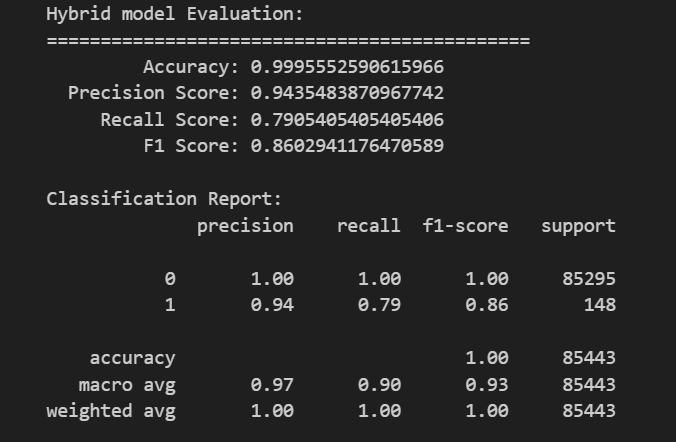
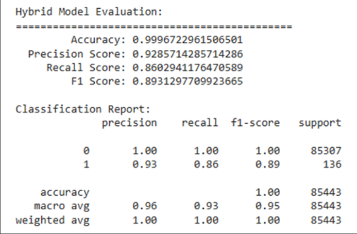

# **EX2實作紀錄:isolation+XGBoost**
選擇isolation+XGBoost是因為範例也是使用這兩種融合，若出來成果不佳聽講解時會有比較直觀的感受。

設定contamination異常樣本的比例，由下圖得出

(以下各參數皆為多次測試下所得出的最佳結果)
樹的數量n_estimator=90
最大深度max_depth=10
學習率learning_rate=0.09
節點分裂所需的最小損失函數下降值gamma=0.6
用於平衡類別不平衡的問題scale_pos_weight=60
threshold=0.55
結果產出:

這是我能調出來最好的結果了，嘗試過加上PCA降維但結果還不如不加，不太確定問題出在哪，我的Accuracy怎麼改都提不上去了，但還是有調到全部高於0.9且precision是有高於範例的0.96。

範例數值

參考資料:
https://cyeninesky3.medium.com/xgboost-a-scalable-tree-boosting-system-%E8%AB%96%E6%96%87%E7%AD%86%E8%A8%98%E8%88%87%E5%AF%A6%E4%BD%9C-2b3291e0d1fe
https://blog.csdn.net/wzk4869/article/details/128738001
https://blog.csdn.net/qq_34160248/article/details/124538485