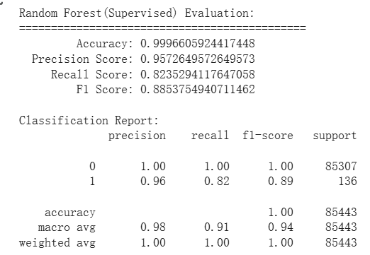
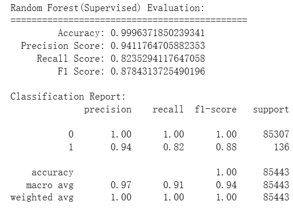
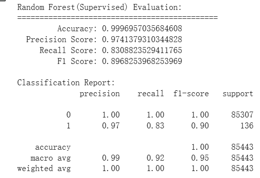
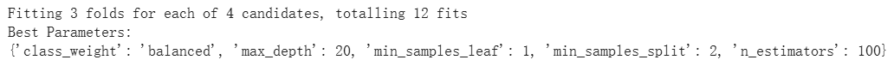
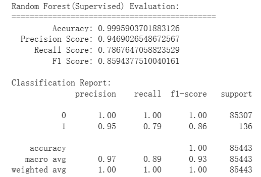
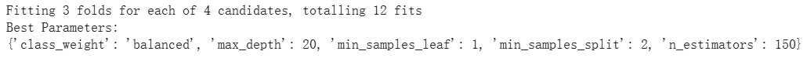
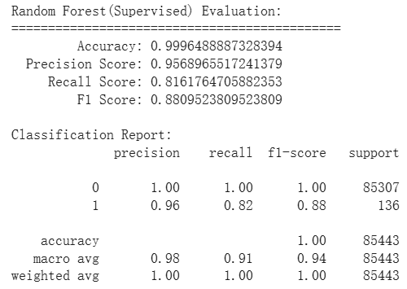
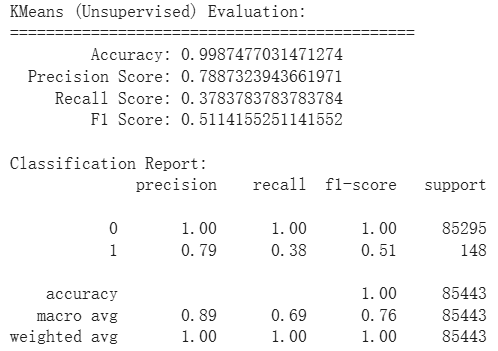
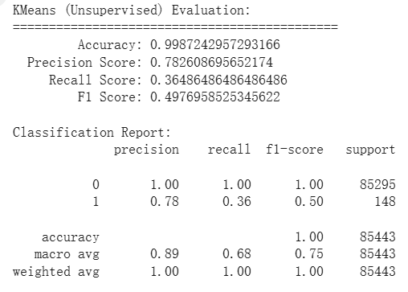

## 監督式學習實驗結果
* Accuracy: 比範例多約 **0.00003**
* Precision Score: 比範例多約 **0.02**
* Recall Score: 比範例多約
* F1 Score: 比範例多約 **0.02**



### 參數調整說明
在這個實驗中採用 Random Forest 模型，主要調整了 3 個參數:
* n_estimators: 決策樹的數量，越高模型會越準確越趨於穩定，但過高容易造成時間成本增加
* max_depth:  限制每顆決策樹可以長多深，太深容易造成模型過於複雜(Overfitting)，太淺模型也可能過於簡單(Underfitting)
* min_samples_split
* min_samples_leaf
* class_weight: 對於不同類別的樣本設定不同權重
```
rf_best = RandomForestClassifier(
    n_estimators=150,
    max_depth=25,
    min_samples_split=2,
    min_samples_leaf=1,
    class_weight={0: 1, 1: 10},
    random_state=42
)
```
首先，我使用了 `Grid search` ，給定 `class_weight`、`max_depth`等的參數範圍，讓他找出 F1 Score 最高的最佳解
```
Best Parameters:
{'class_weight': 'balanced', 'max_depth' : 20, 'min_samples_leaf' : 1, 'min_samples_split' : 2, 'n_estimators' : 150}
```
依照找到的解的參數再進行微調，因為這是個嚴重不平衡的資料集，詐欺交易相對非詐欺交易非常的少，因此我嘗試將詐欺交易的權重調高，讓模型更願意抓詐欺交易，避免少漏抓詐欺交易提高 recall 值


### 原本




### try 1










---

rf_best = RandomForestClassifier(
    n_estimators=150,
    max_depth=20,
    min_samples_split=2,
    min_samples_leaf=1,
    class_weight={0: 1, 1: 10},
    random_state=42
)

---

## 非監督式學習實驗結果
* Accuracy: 比範例多約 **0.00002**
* Precision Score: 比範例多約 **0.06**
* Recall Score: 比範例多約 **0.02**
* F1 Score: 比範例多約 **0.01**



### 參數調整說明
主要使用了**PCA**降低特徵值維度，測試下來維度25會使結果最好，再低會造成資料過於簡化而抓不到詐欺交易
```
pca = PCA(n_components=25)
x_train = pca.fit_transform(x_train)
x_test = pca.transform(x_test)
```
### 原本
