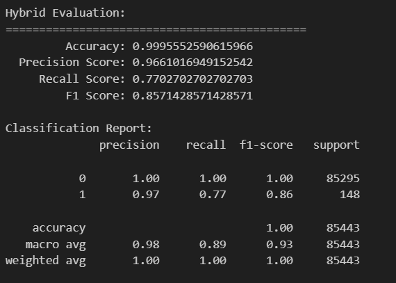

# 監督式學習
## 使用 XGBoost
因為rando forest參數調整後整體結果沒有明顯改變，且速度較慢

所以放棄繼續鑽研，改成使用XGBoost

>
    xgb_model = xgb.XGBClassifier(
    n_estimators=175,
    learning_rate=0.2,
    max_depth=7,
    scale_pos_weight=3, 
    =RANDOM_SEED)
>

>
 * n_estimators 太少會學習不足
* learning rate 從1往下調整 0.2 就頗佳
* max_depth 太深反而效果不好 7是試過的最佳值

## 最後結果

# 非監督式學習
## 加入PCA
嘗試更改KMeans參數但常常直接出現0，加入PCA後只有好一點點(大概0.1)
>   
    pca = PCA(n_components=0.95) // 降維：保留 95% 的總變異量
    x_train = pca.fit_transform(x_train)
    x_test = pca.transform(x_test)
>

## 使用Isolation forest
>
    iso = IsolationForest(
    contamination=0.0017,
    n_estimators=300,
    random_state=RANDOM_SEED)
>
* contamination=0.0017 因為資料集異常值17%
* n_estimators=300 多一點樹增加穩定性

兩者嘗試效果居然一樣：0
