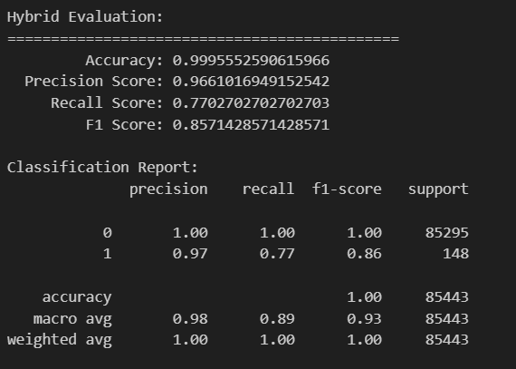

# Isolation + XGBoost

結合作業1使用的Isolation + XGBoost

## 多種非監督方法生成特徵
### PCA資訊濃縮
>
    pca = PCA(n_components=25) 
    // n_components=10~25此範圍中數值越大 Precision Score越高
    x_train = pca.fit_transform(x_train)
    x_test = pca.transform(x_test)
>

### 用Isolation forest生成異常分數
>
    iso = IsolationForest(contamination=0.0017,n_estimators=300,random_state=RANDOM_SEED)
    iso.fit(x_train)
    // decision_function 會給每筆資料一個異常分數
    anomaly_score_train = iso.decision_function(x_train)
    anomaly_score_test = iso.decision_function(x_test)
>

### 加入KMeans 對正常樣本分群，推測測試資料所屬群

>
    只使用正常樣本來訓練群集
    normal_train = x_train[y_train == 0]
    kmeans = KMeans(n_clusters=3, init='k-means++', random_state=42)
    kmeans.fit(normal_train)

    對整個訓練 & 測試資料預測所屬 cluster
    cluster_train = kmeans.predict(x_train)
    cluster_test = kmeans.predict(x_test)

    將 cluster label one-hot encode（也可以直接用 label）
    from sklearn.preprocessing import OneHotEncoder

    enc = OneHotEncoder(sparse_output=False, handle_unknown='ignore')
    cluster_train_oh = enc.fit_transform(cluster_train.reshape(-1, 1))
    cluster_test_oh = enc.transform(cluster_test.reshape(-1, 1))
>
### 合併所有特徵
>
    原始特徵 + 異常分數 + KMeans cluster label
    x_train_ext = np.hstack((x_train, anomaly_score_train.reshape(-1, 1), cluster_train_oh))
    x_test_ext = np.hstack((x_test, anomaly_score_test.reshape(-1, 1), cluster_test_oh))

>
## 監督式分類訓練與預測
### XGBoost參數
>
    import xgboost as xgb
    xgb_model = xgb.XGBClassifier(n_estimators=175,
    learning_rate=0.05,
    max_depth=7,
    scale_pos_weight=5,
    random_state=RANDOM_SEED)

    xgb_model.fit(x_train_ext, y_train)

    y_pred = xgb_model.predict(x_test_ext)
>
* learning_rate 原本的 0.2 結果不好 逐步調低後 Precision Score 有逐步提高的趨勢 

## 最後結果

* precision score 在 調整 lr 後有明顯提升！
* recall 和 F1 score 始終還是無法提高QQ